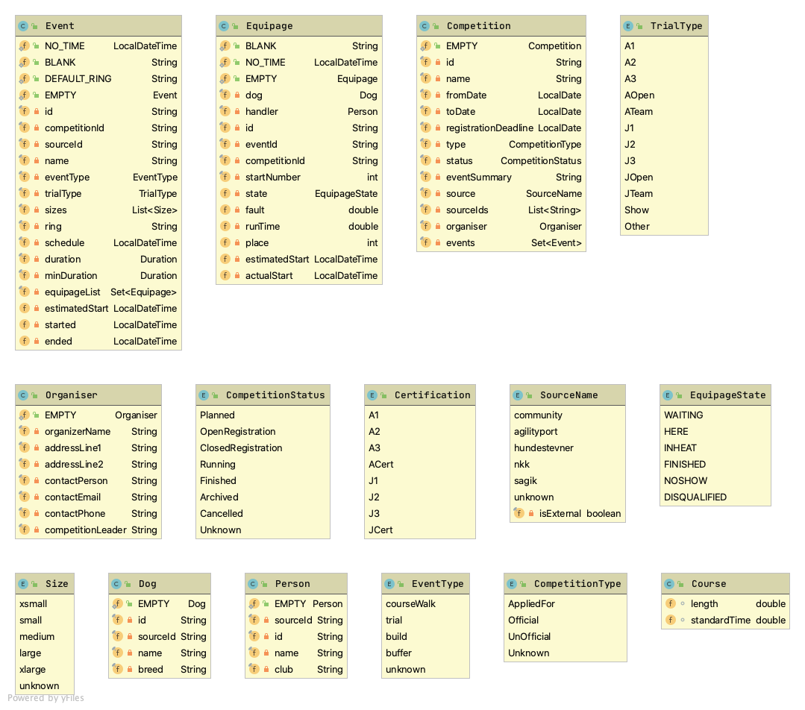

Agility Port Backend
=====================

Backend support for the agility port project. 

Main activities: 

* importing data from external systems
* maintain data integrity (stale data, version conversions etc)
* restapi for some write operations, maintenance and reporting 
 
This is a google app engine application for the java 11 runtime.

# Vision
This started as a scheduler - an application to figure out when you are
running with which of your dogs at what ring for the Norwegian Open competition. 
The idea was to monitor live results and adjust the schedule accordingly. 
Now the vision is a bit broader and basically is to provide a complete IT system for Agility. 

* The best place to look up agility results
* The best place to stream live results
* The best place to plan future competitions as both participants and as organiser
* The best place to run a competition as an organizer
* The best place to do analysis and statistics

And for the entire world - the more the merrier.  

# Datamodel

Created with the Intellij plugin [UML Generator](https://github.com/alessandro-caldonazzi/UMLGenerator)

In firestore (the db) the main structure is that a competition collection has an event sub-collection which has an
equipage sub-collection. More top-level collections are expected to come. 

# Plan
1. Import results from external systems and make sure frontends can work efficiently with it 
2. Open for community based competitions
3. Add features to run community based competition

# TODO
* Brush up the nkk source importer
* Add country to Competition, Dog and Person
* Consider split Competitions into top level collection based on country
* Add region field to Competition
* Add toplevel Dog collection
* Add toplevel Person collection
* Maintain Dog and Person collections with an expanded history subcollection of equipage records (expand some event and competition fields into this)

# Database maintenance TODO
* Some equipages has not event and competition id set (sagik 2016 and 2017)
* Dogs in competitions from sagik 2016 and 2017 has no sourceid
* Sagik has startNumber issues and many other events (which is wrong)